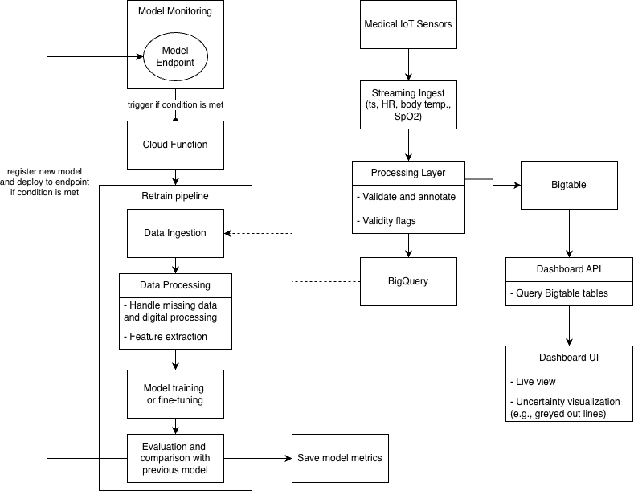

# Architecture

The overall architecture of this Medical IoT Pipeline is illustrated in the diagram below.

The architecture assumes that individual samples (or events) are streamed in real time and ingested by a **Processing Layer**, which performs validation and normalization before making the data available for downstream consumption. The Processing Layer fan-outs each processed sample to two downstream consumers, which persist the data in different storage systems according to access patterns and latency requirements.

**Bigtable** is used as a hot storage layer, retaining recent data (including both physiological samples and system logs) for a limited time window. This enables low-latency access to support real-time dashboards and operational monitoring.

**BigQuery**, in contrast, acts as the long-term analytical data warehouse. It stores the same samples and logs permanently, enabling large-scale analytics, historical analysis, model training, and auditability.

In parallel, a closed-loop **machine learning architecture** supports a deployed model that predicts septic shock risk. The model is trained and monitored using data stored in BigQuery, which serves as the source of truth for both training and evaluation datasets.

If model drift detection triggers an alert in production, a **Model Retraining Pipeline** is automatically invoked. This pipeline retrains the model on recent data, evaluates its performance against the currently deployed model using predefined metrics, and deploys the new model only if performance and safety criteria are met.

## Processing Layer

The processing layer receives real-time data from multiple sensors and should prepare data for downstream long-term storage and ML pipelines (BigQuery) as well as shorter-term storage which feeds into a live Dashboard (Bigtable).

This layer expects to receive a dictionary-style input with a set of keys (e.g., `{"event_timestamp": "2026-01-27T13:50:50.771629", "sensor_id": "icu-monitor-004", "heart_rate": 70.5, "body_temperature": 37.07, "spO2": 97, "battery_level": 41}`). However, it should be able to handle issues such as:

- **Partial or malformed packets:** The input is not in dictionary format, contains missing keys, or includes missing/null values.
- **Time-related issues:** Duplicate timestamps (e.g., from retransmissions), unparseable event timestamps, or impossible timestamps (e.g., in the future or out-of-order —- see note below).
- **Physiological anomalies:** Values outside the plausible physiological range, or sensors reporting a constant/stuck value (see comment below).

**NOTE:** This implementation assumes that packets are received in order. If a packet for a given `sensor_id` contains an `event_timestamp` earlier than the latest received timestamp for the same `sensor_id`, it is treated as impossible.

> **COMMENT:** Sensors reporting a constant value for a prolonged period may indicate a hardware malfunction or sensor placement issue. Detecting this reliably would require custom logic for each physiological signal, due to their differing non-stationary behaviors; therefore, this check will not be implemented at this stage.

Physiological ranges were initially defined based on commonly cited literature and online sources, but should be refined according to clinical evidence and peer-reviewed studies:

- Heart Rate (HR): 0--350 bpm [(Cleveland Clinic 2024)](<[%3Chttps://doi.org/10.1016/s0735-1097(00)01054-8%3E](https://my.clevelandclinic.org/health/diseases/22885-atrial-flutter)>)
- Body temperature: 25--45°C [(Suchard 2007](https://pmc.ncbi.nlm.nih.gov/articles/PMC2672216/), [Oprita et al. 2025)](https://pmc.ncbi.nlm.nih.gov/articles/PMC11900338/)
- Peripheral oxygen saturation (SpO2): 0--100%

> **COMMENT:** Couldn't find an adequate source for SpO2 range.

### Cleaning Logic

In compliance with regulatory requirements (under the [Data Act](https://arc.net/l/quote/bukvrfhl) raw data must be retained), data is not transformed at the processing layer. This ensures full transparency and traceability of all measurements. Maintaining the raw data is also critical for downstream system monitoring and operational oversight, including logging, device health checks, and data integrity verification.

As such, the processing layer is responsible for validating incoming data, flagging missing or invalid measurements, and ensuring correct data types and formats before storing data in hot storage or the data warehouse.

Missing, invalid, or impossible samples are flagged according to the modality where the issue was observed:

- **Physiological data and battery:** Invalid measurement due to physiological anomalies (`*_INV`, where `*` represents a modality -- check [SCHEMA_DEFENSE.md](design_docs/SCHEMA_DEFENSE.md) for all flags), or missing measurements (`*_NAN`).
- **Timestamps:** Event timestamps that are out-of-order or in the future relative to the system (`TS_IMP`), or that cannot be parsed (`TS_INV`). Duplicate timestamps are automatically handled by Bigtable’s garbage collection policy (see [SCHEMA_DEFENSE.md](design_docs/SCHEMA_DEFENSE.md)); at this stage, duplicate timestamps are not handled or flagged by BigQuery.
- **Malformed packet:** In the case of a malformed packet, the `*_NAN` flag is applied to all physiological data and battery, and the `TS_INV` flag is applied to the sample (event) timestamp.

**NOTE:** Whenever the flag `TS_INV` is set, a placeholder value of 0 ms (representing `1970-01-01 00:00:00+00:00`) is stored to prevent conversion and storage errors.

> **COMMENT:** At this stage, the Processing Layer handles one sample at a time. However, for higher throughput, it may be beneficial to do batch upload, as least to Bigtable. But not sure -- would have to evaluate more thoroughly.

### Data Formatting

Before sending the clean data to downstream consumers, it is formatted to conform to the required data types, as specified in [SCHEMA_DEFENSE.md](design_docs/SCHEMA_DEFENSE.md).

### Storage

The same formatted data is sent to downstream consumers of both Bigtable and BigQuery, which handle storage and access according to the requirements of their respective environments and query languages.

### Dashboard API/UI

Although not implemented here, the envisioned Dashboard API/UI helps illustrate how the processing layer handles the issues described above.

The Dashboard is intended as a live view of a specific patient (or a group of patients) over a configurable observation period. It may display physiological statistics (e.g., mean and maximum HR) along with plots of the time series, as well as system health indicators, such as sensor connectivity or data completeness.

Accordingly, missing or invalid data should be explicitly represented, not only through visualization cues (e.g., greyed-out graph segments) but also in system-level summaries, such as the percentage of downtime or data loss over the observation period. In this context, the second Bigtable table, containing “bad-sample” logs, becomes invaluable. For a more thorough discussion see [SCHEMA_DEFENSE.md](design_docs/SCHEMA_DEFENSE.md).

If some sensor data is missing or invalid, the entire sample is not discarded. Instead, the system should ensure that missing values are clearly represented in the visualization, while displaying the remaining valid measurements. This approach preserves information that may help identify the root cause of anomalies. For example, if the temperature measurement is within the physiological range but HR and SpO2 values are invalid, this may indicate that the sensor is properly worn but incorrectly positioned for PPG-based measurements.

## Model Retraining Pipeline

In a septic shock risk prediction system, ground-truth outcome labels are typically not available in real time. As a result, the feedback loop following a model drift alert cannot immediately rely on supervised performance metrics. Instead, drift detection is first driven by unsupervised signals, such as distributional shifts in physiological measurements or changes in the distribution of predicted risk scores.

As outcome labels become available retrospectively (e.g., after delayed EHR integration), they are joined with previously ingested data to enable delayed performance evaluation and supervised retraining.

This pipeline operates under the following assumptions:

- Model drift detection has already occurred and triggered the retraining pipeline.
- BigQuery acts as the source of truth and supports querying both physiological data and delayed outcome labels (stored in a separate table and joined through `sensor_id` and `ts_smp`).
- Physiological measures are treated as features: a feature set is defined by the valid heart rate, body temperature, and SpO2.
- The same model architecture and hyperparameters are reused during retraining to isolate data drift effects from model design changes (in this implementation, a dummy model is used).

### Data Retrieval from BigQuery and Training

Model retraining is performed offline using a time-aware **partitioning of historical and newly arrived data** retrieved from BigQuery. The retraining dataset is constructed relative to the data cutoff timestamp of the currently deployed model.

The split logic is defined as follows:

- New data (samples ingested after the last training timestamp of the currently deployed model):
  - First 70% of these samples are assigned to the training set.
  - Remaining are reserved as a hold-out test set for evaluating the newly trained model on previously unseen, up-to-date data.

- Old training data (samples used to train the currently deployed model):
  - The most recent portion of the historical training data is appended to the new training set.
  - This results in a training dataset composed of an approximately balanced mix of historical and recent samples, helping preserve previously learned physiological patterns while adapting to newer data.

- Old test data (samples used to evaluate the currently deployed model):
  - Fully retained as an additional evaluation set, allowing explicit assessment of whether the new model maintains performance on historical evaluation data.

This strategy directly addresses catastrophic forgetting by ensuring that retraining does not rely solely on newly observed data, while still prioritizing adaptation to recent patient populations, sensor behavior, and clinical practice. At the same time, it reflects the inherently non-stationary nature of physiological signals, where recent data is often more informative for future predictions.

All data retrieval queries are explicitly registered as model metadata (e.g., via time boundaries) to ensure full reproducibility and traceability of each retraining run.

**NOTE:** Time-aware partitioning is based on `ts_ing`.

> **COMMENT:** Other train-test split strategies could also be appropriate for this use case, including patient-specific or more sophisticated temporal approaches. This implementation was selected because it demonstrates the full pipeline functionality with moderate complexity while remaining straightforward to implement.

### Evaluation and Conditioned Deployment

After training, the newly trained model is evaluated and compared against the currently deployed model. Evaluation metrics produced during training (e.g., AUPRC on recent and legacy test sets) are loaded alongside the stored metadata of the previous model from the Vertex AI Model Registry.

A tolerance-based decision rule is applied:

- Deployment is rejected if performance on legacy data **degrades beyond an acceptable threshold**.
- Deployment is approved only if the new model shows a **meaningful improvement over the previous model** on current data.

This closed-loop retraining architecture enables continuous model adaptation while preserving reproducibility, auditability, and safety—key requirements for clinical risk prediction systems.
